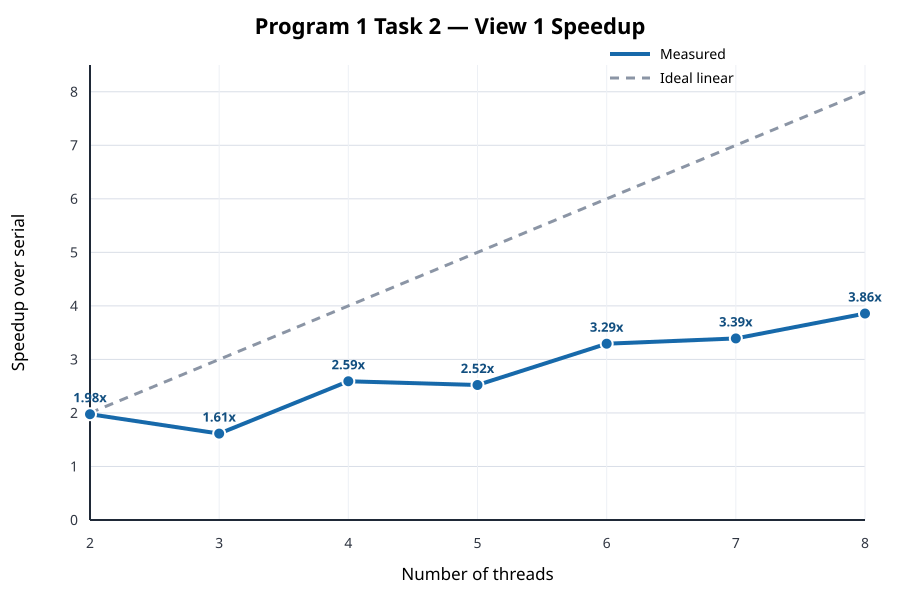

# Program 1, Task 2 — Block-Decomposition Scaling



The numeric measurements are available in [results.md](results.md) and
[results.csv](results.csv). The complete program output for every point is in
[`raw/`](raw/).

## English write-up

### Method

I kept the required static block decomposition: with `N` threads, each worker
receives one contiguous block of image rows, and the last worker receives any
remainder. I rendered View 1 with 2, 3, 4, 5, 6, 7, and 8 threads.

The experiment used a native Windows Release build on an Intel Core i5-13500HX.
This is a 6P+8E host, so I ran the program with `--simulate-myth4`. That mode
restricts the experiment to four physical P-cores and their eight SMT contexts.
The serial reference is pinned to the first selected P-core. Threads 0–3 use
the first SMT context of four different cores, and threads 4–7 use the second
SMT contexts of those same four cores. Each reported serial and threaded time
is the minimum of five trials performed internally by the starter program.

### Results and analysis

The measured speedups for 2–8 threads were 1.98x, 1.61x, 2.59x, 2.52x, 3.29x,
3.39x, and 3.86x. The curve is clearly not linear: adding a thread can produce
little improvement and can even reduce performance.

My hypothesis is that the dominant cause is load imbalance. Mandelbrot pixels
do not all cost the same amount: pixels that escape quickly require few loop
iterations, while pixels near or inside the set require many. Since neighboring
pixels tend to have similar costs, assigning contiguous row blocks gives the
workers unequal amounts of computation. The threaded completion time is set by
the slowest worker, so cores whose blocks finish early remain idle.

The three-thread point supports this hypothesis. With a 1200-row image, the
three blocks are rows 0–399, 400–799, and 800–1199. The middle block crosses the
expensive central portion of View 1, while the upper and lower blocks contain
more quickly escaping pixels. In contrast, the two-thread split benefits from
the approximate vertical symmetry of View 1, so its two halves are better
balanced. This explains why the measured speedup falls from 1.98x with two
threads to 1.61x with three threads.

Hardware effects also prevent linear scaling. The simulated machine has four
physical cores, so threads 5–8 share execution resources with threads already
running on those cores through SMT. Thread creation overhead, cache effects,
and dynamic clock frequency add smaller deviations. These effects, together
with the block imbalance, explain why eight threads reach only 3.86x instead of
the ideal 8x.

This is the Task 2 hypothesis based on aggregate timing. Task 3 should test it
directly by measuring the elapsed time of every worker. The numbers here are
from a topology simulation on the i5-13500HX, not measurements from a Stanford
`myth` host, so they should be labeled as local-machine results in a submission.

## 中文分析

### 实验方法

本实验保留题目要求的静态连续块划分：使用 `N` 个线程时，每个线程负责一段连续图像行，最后一个线程处理不能整除的余数。测试范围为 View 1 的
2、3、4、5、6、7 和 8 个线程。

实验在 Intel Core i5-13500HX 上使用原生 Windows Release 版本完成。宿主处理器是
6P+8E，因此程序通过 `--simulate-myth4` 将运行范围限制为 4 个物理 P 核及其
8 个 SMT 上下文。串行基准固定在第一个选中的 P 核；线程 0–3 分别使用四个物理核的第一个 SMT，线程 4–7 使用相同四核的第二个 SMT。串行与多线程时间都是程序内部五次运行的最小值。

### 结果与解释

2–8 线程的实测加速比分别为 1.98x、1.61x、2.59x、2.52x、3.29x、3.39x 和
3.86x。曲线明显不是线性的：增加线程有时只能带来很小的提升，甚至会降低性能。

主要假设是连续块产生了负载不均衡。Mandelbrot 不同像素的计算量并不相同：快速逃逸的像素只执行少量循环，而集合内部或边界附近的像素会执行很多次迭代。相邻像素的计算量通常又比较接近，因此连续行块会让不同线程获得明显不同的工作量。整个并行阶段必须等待最慢线程，提前完成的核心只能空闲。

3 线程数据很好地支持了这一假设。1200 行图像被划分为 0–399、400–799 和
800–1199 三段，其中中间块穿过 View 1 计算量较大的中央区域，而上下两块包含更多快速逃逸的像素。2 线程划分则受益于 View 1 近似的上下对称性，两半的负载更接近。因此线程数从 2 增加到 3 时，加速比反而从 1.98x 降到了 1.61x。

硬件因素也会阻止线性加速。模拟机器只有 4 个物理核心，所以第 5–8 个线程必须通过
SMT 与已有线程共享同一个核心的执行资源。线程创建、缓存行为和动态频率还会引入较小波动。它们与连续块负载不均衡共同导致 8 线程只有 3.86x，而不是理想的 8x。

以上仍是 Task 2 根据整体运行时间提出的假设；Task 3 应通过记录每个 worker 的耗时直接验证。这里的数据来自 i5-13500HX 上的拓扑模拟，并非 Stanford `myth` 实机结果，提交时应明确标注为本地机器实验。

## Reproduce the experiment / 复现实验

Build a native Windows Release executable, then run the dependency-free Python
script. From WSL, for example:

```bash
python3 task2/benchmark_task2.py \
  --executable /mnt/c/path/to/build/Release/mandelbrot.exe
```

From a Windows terminal with Python installed:

```powershell
py task2\benchmark_task2.py `
  --executable build\Release\mandelbrot.exe
```

The script updates each raw log as its case runs, then replaces `results.csv`,
`results.md`, and `speedup_view1.svg` after all seven cases pass validation.
