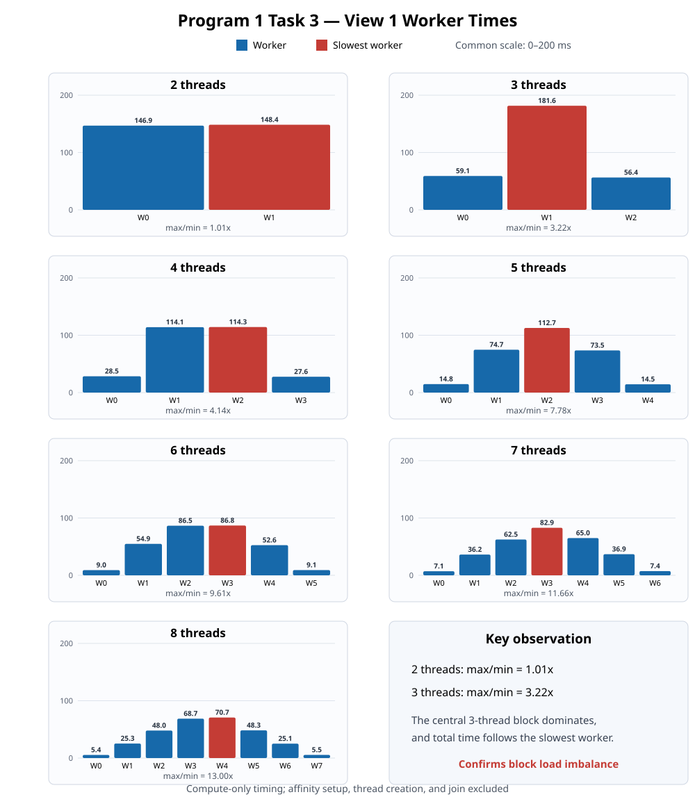

# Program 1, Task 3 — Per-Worker Timing



The aggregate measurements are in [summary.csv](summary.csv), the long-form
worker data are in [worker_times.csv](worker_times.csv), and formatted tables
are in [results.md](results.md). Complete program output is preserved in
[`raw/`](raw/).

## English write-up

### Method

I added an optional `--profile-workers` mode without changing the contiguous
row-block decomposition from Task 2. The benchmark requests that historical
policy explicitly with `--decomposition block`. Each worker starts its timer after its CPU
affinity has been applied and stops it immediately after its Mandelbrot block
has been computed. Therefore, the worker values measure row partitioning and
pixel computation, but exclude thread creation, `join()`, affinity setup and
restoration, image output, and printing.

The program still performs five threaded trials. It retains the complete set
of worker measurements from the trial with the smallest total threaded time,
so the per-worker values and the reported speedup describe the same execution.
Workers write separate timing slots, and the main thread prints them only after
all workers have joined; profiling adds no locks or worker-side output.

As in Task 2, I used a native Windows Release build on an Intel Core i5-13500HX
with `--simulate-myth4`. The process was restricted to four P-cores and their
eight SMT contexts, and View 1 was measured with 2 through 8 threads.

### Results

The measurements confirm the Task 2 load-imbalance hypothesis. With two
threads, the upper and lower halves took 146.887 ms and 148.412 ms, an imbalance
of only 1.01x. The total threaded trial took 148.660 ms, only 0.248 ms longer
than the slowest worker, so both physical cores were useful for almost the
entire computation.

With three threads, worker 1, which owned rows 400–799, took 181.577 ms. Workers
0 and 2 took only 59.051 ms and 56.416 ms. Thus, the middle block required 3.22x
as long as the fastest block, and the other two cores were idle for roughly the
last two thirds of the computation. The complete threaded trial took 182.039
ms, almost exactly the time of worker 1. This directly explains the Task 2
anomaly: three threads were slower than two because the three-way split placed
most expensive rows in one central block, while the two-way split produced two
nearly symmetric and balanced halves.

The same spatial pattern appears for all larger thread counts. Blocks near the
top and bottom finish very quickly, while the central blocks dominate. The
maximum-to-minimum worker-time ratio grows from 4.14x at four threads to 13.00x
at eight threads. For example, with eight threads, workers 3 and 4 took 68.719
ms and 70.679 ms, while workers 0 and 7 needed only 5.436 ms and 5.461 ms. The
70.928 ms total again closely follows the 70.679 ms critical worker rather than
the average worker time.

SMT also affects the 5–8 thread cases: the extra workers share execution
resources with threads already placed on the four physical P-cores. However,
SMT alone cannot explain the strong symmetric timing pattern across image row
ranges or the three-thread regression, where every worker occupies a separate
physical core. The measurements therefore confirm that static contiguous-block
load imbalance is the primary cause of the non-linear Task 2 speedup curve;
thread overhead, SMT resource sharing, caches, and clock variation are
secondary effects.

These results come from a topology simulation on the i5-13500HX, not a Stanford
`myth` machine, and should be identified as local-machine measurements in a
submission.

## 中文分析

### 实验方法

程序新增了可选的 `--profile-workers` 模式，并通过 `--decomposition block` 显式保留
Task 2 的连续行块划分。每个
worker 在完成 CPU 亲和性绑定后开始计时，在 Mandelbrot 行块计算结束后立即停止计时。因此这些数值包含行划分和像素计算，不包含线程创建、`join()`、亲和性设置与恢复、图像写出或打印。

程序仍运行五次 threaded trial，并保留总 threaded 时间最短的那次执行所对应的完整
worker 时间组，所以逐线程数据与最终 speedup 来自同一次执行。每个 worker 只写自己的计时槽，所有线程 `join()` 后再由主线程统一打印，没有增加锁或 worker 内部输出。

与 Task 2 相同，本实验在 Intel Core i5-13500HX 上使用原生 Windows Release 版本和
`--simulate-myth4`，将程序限制在 4 个 P 核和 8 个 SMT 上下文中，并测量 View 1 的
2–8 线程。

### 结果

测量结果确认了 Task 2 的负载不均衡假设。2 线程时，上下两半分别耗时 146.887 ms 和
148.412 ms，失衡比例只有 1.01x；完整 threaded trial 为 148.660 ms，只比最慢 worker
多 0.248 ms，因此两个物理核心在绝大部分时间都得到了有效利用。

3 线程时，负责 400–799 行的 worker 1 耗时 181.577 ms，而 worker 0 和 worker 2
分别只需要 59.051 ms 和 56.416 ms。中间块耗时是最快块的 3.22 倍，另外两个核心在计算后约三分之二的时间里处于空闲。完整 threaded trial 为 182.039 ms，几乎完全由
worker 1 决定。这直接解释了 Task 2 的异常：三等分把大部分高计算量行集中给了中央线程；二等分则产生近似上下对称、负载接近的两半，所以 3 线程反而慢于 2 线程。

更高线程数也呈现相同的空间分布：顶部和底部的块很快完成，中央块决定总时间。最大与最小 worker 时间之比从 4 线程的 4.14x 增长到 8 线程的 13.00x。以 8 线程为例，
worker 3 和 4 分别耗时 68.719 ms 和 70.679 ms，而 worker 0 和 7 只有 5.436 ms
和 5.461 ms；70.928 ms 的总时间同样紧跟 70.679 ms 的关键 worker，而不是平均
worker 时间。

5–8 线程还会受到 SMT 的影响：新增线程必须与已经运行在四个物理 P 核上的线程共享执行资源。但 SMT 无法解释不同图像行区间呈现出的强烈对称耗时分布，也无法解释 3 线程退化——3 线程时每个 worker 都位于独立物理核。因此测量确认：静态连续块造成的负载不均衡是
Task 2 非线性加速曲线的主要原因；线程开销、SMT 资源共享、缓存和动态频率属于次要因素。

这些数据来自 i5-13500HX 上的拓扑模拟，并非 Stanford `myth` 实机结果，提交时应标注为本地机器测量。

## Reproduce the experiment / 复现实验

Build a native Windows Release executable containing the profiling change,
then run the dependency-free Python script. From WSL:

```bash
python3 task3/benchmark_task3.py \
  --executable /mnt/c/path/to/build/Release/mandelbrot.exe
```

From a Windows terminal with Python installed:

```powershell
py task3\benchmark_task3.py `
  --executable build\Release\mandelbrot.exe
```

The script updates each raw log as its case runs, then replaces
`worker_times.csv`, `summary.csv`, `results.md`, and
`worker_times_view1.svg` after all seven cases pass validation.
