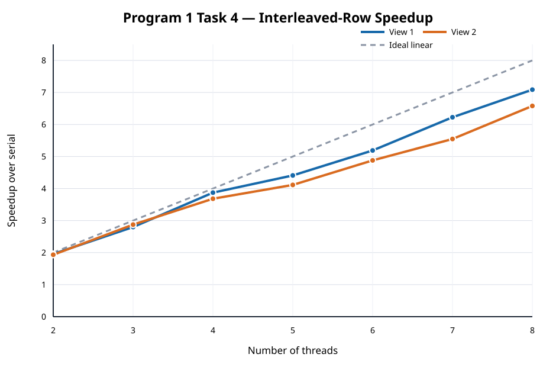

# Program 1, Task 4 — Static Interleaved Rows



Numeric results are in [results.md](results.md) and [results.csv](results.csv). The 8-thread worker data are in [worker_times_8.csv](worker_times_8.csv), and complete output is preserved in [`raw/`](raw/).

## English write-up

### Approach

I replaced the default contiguous block assignment with one static cyclic rule. For `N` threads, worker `i` computes rows `i`, `i + N`, `i + 2N`, and so on. The same rule works for every thread count and both views; it contains no special cases based on the image or thread count. Every row has exactly one residue modulo `N`, so workers write disjoint output rows and require no locks, atomics, barriers, or work queues.

This assignment spreads each worker's rows throughout the image. Expensive Mandelbrot regions that were concentrated in the middle block in Tasks 2 and 3 are therefore shared across all workers. The old policy remains available as `--decomposition block` solely to reproduce those experiments; the program now defaults to `interleaved`.

### Method and results

I used a native Windows Release build on an Intel Core i5-13500HX with `--simulate-myth4 --decomposition interleaved --profile-workers`. The process was restricted to four P-cores and their eight SMT contexts, and the serial reference was pinned to the first selected P-core. Each serial and threaded value is the minimum of five internal trials.

At eight threads, View 1 reached **7.09x** speedup with a 1.03x maximum-to-minimum worker-time ratio. View 2 reached **6.58x** speedup with a 1.05x worker-time ratio. At least one local 8-thread measurement is below the assignment's 7x target. These are retained as measured rather than presented as Stanford myth results.

The much smaller worker-time spread compared with the 13.00x ratio from Task 3 View 1 confirms that cyclic rows fix the dominant block imbalance. Remaining differences from ideal linear speedup come from SMT siblings sharing execution resources on four physical cores, thread overhead, cache effects, and dynamic clock frequency. This i5-13500HX experiment simulates the requested 4P/8SMT topology; it is not a Stanford `myth` measurement.

## 中文分析

### 实现方法

默认连续块划分被替换为一条静态循环规则：使用 `N` 个线程时，worker `i` 负责第 `i`、`i + N`、`i + 2N`……行。同一规则适用于所有线程数和两个视图，没有针对图像或线程数硬编码。每一行对 `N` 的余数唯一，因此每个 worker 写入互不重叠的输出行，不需要锁、原子操作、屏障或动态任务队列。

这种划分让每个线程的行分散在整个图像中，将 Task 2/3 中集中于中央连续块的高计算量区域平均分给所有线程。旧策略仍可通过 `--decomposition block` 复现，但程序默认使用 `interleaved`。

### 实验与结果

实验使用 Intel Core i5-13500HX 的原生 Windows Release 版本，参数为 `--simulate-myth4 --decomposition interleaved --profile-workers`。进程被限制在 4 个 P 核及其 8 个 SMT 上下文中，串行参考固定在第一个选中 P 核；串行和并行时间均取程序内部五次 trial 的最小值。

8 线程时，View 1 的加速比为 **7.09x**，worker 最大/最小耗时比为 1.03x；View 2 的加速比为 **6.58x**，耗时比为 1.05x。至少一个视图的本机 8 线程结果低于题目给出的 7x 目标；报告保留真实数据，不将其冒充为 Stanford myth 实机结果。

与 Task 3 View 1 的 13.00x 失衡比相比，现在的 worker 耗时差距显著缩小，证明循环行划分解决了主要的连续块负载不均衡。与理想线性加速的剩余差距来自四个物理核上的 SMT 资源共享、线程开销、缓存行为和动态频率。本实验只是在 i5-13500HX 上模拟指定的 4P/8SMT 拓扑，并非 Stanford `myth` 实机数据。

## Reproduce / 复现

```bash
python3 task4/benchmark_task4.py \
  --executable /mnt/c/path/to/build/Release/mandelbrot.exe
```

```powershell
py task4\benchmark_task4.py `
  --executable build\Release\mandelbrot.exe
```
