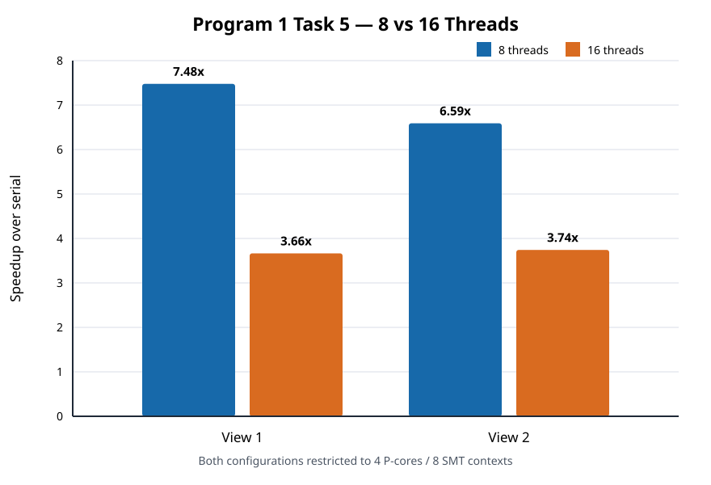

# Program 1, Task 5 — 8 vs 16 Threads



See [results.md](results.md), [results.csv](results.csv), [worker_times.csv](worker_times.csv), and the complete [`raw/`](raw/) program output.

## English write-up

### Method

I ran the final static interleaved-row implementation with 8 and 16 software threads on both views. The native Windows Release executable used `--simulate-myth4 --decomposition interleaved --profile-workers`. Both configurations were restricted to exactly the same four physical P-cores and eight SMT hardware contexts. With eight threads, each worker was pinned to one context. With sixteen threads, workers were not bound round-robin; Windows scheduled them within the process's eight-context CPU Set restriction. Each timing is the minimum of five internal trials.

### Results and explanation

For View 1, eight threads took 40.551 ms (7.48x), while sixteen took 77.209 ms (3.66x). Thus the sixteen-thread run had 0.525x the performance of the eight-thread run, with a +90.4% elapsed-time change. For View 2, the corresponding values were 23.846 ms (6.59x) and 42.864 ms (3.74x), or 0.556x relative performance and a +79.8% elapsed-time change.

Performance is not greater with sixteen threads because the simulated machine still exposes only eight hardware contexts. Eight workers already occupy all four cores and both SMT contexts per core. Sixteen workers therefore oversubscribe those same contexts: at most eight can execute at once, while the operating system time-slices the rest. The extra threads add creation, join, scheduling, and context-switch costs and can increase cache pressure. In this run the regression is substantial, not merely noise. All sixteen workers still receive exactly 75 rows, but their wall-clock time ratios grow to 2.93x and 2.70x. Those timers include time spent descheduled, so this spread is evidence of scheduler time-slicing rather than unequal Mandelbrot work. Static interleaving balances row work, but it cannot create additional execution resources; the exact regression is platform- and scheduler-dependent.

These are i5-13500HX measurements under a 4P/8SMT topology restriction, not results from a Stanford `myth` host.

## 中文分析

### 实验方法

最终静态交错行实现分别使用 8 和 16 个软件线程运行两个视图。原生 Windows Release 程序使用 `--simulate-myth4 --decomposition interleaved --profile-workers`，两种线程数都被限制在完全相同的 4 个物理 P 核和 8 个 SMT 硬件上下文中。8 线程时每个 worker 固定到一个上下文；16 线程时不进行循环硬绑定，而由 Windows 在进程的 8-context CPU Set 限制内调度。每个时间都是程序内部五次 trial 的最小值。

### 结果与解释

View 1 的 8 线程时间为 40.551 ms，加速比 7.48x；16 线程时间为 77.209 ms，加速比 3.66x。16 线程相对性能为 0.525x，耗时变化 +90.4%。View 2 的 8/16 线程时间分别为 23.846 ms 和 42.864 ms，加速比分别为 6.59x 和 3.74x；16 线程相对性能为 0.556x，耗时变化 +79.8%。

16 线程并没有更快，因为模拟机器仍然只有 8 个硬件上下文。8 个 worker 已经占满四个核心的两个 SMT 上下文；16 个 worker 只能过量订阅同一批上下文，任意时刻最多仍有 8 个执行，其余线程由操作系统分时调度。额外线程增加了创建、`join`、调度和上下文切换开销，也可能增加缓存压力。本次退化幅度明显，不只是普通噪声。16 个 worker 都恰好负责 75 行，但墙钟耗时比分别增长到 2.93x 和 2.70x；worker 计时包含被操作系统暂停的时间，因此这是分时调度的证据，而不是 Mandelbrot 计算量重新失衡。静态交错能平衡行工作量，却无法产生新的执行资源；具体退化幅度取决于平台和调度器。

这些数据来自 i5-13500HX 上的 4P/8SMT 拓扑限制，并非 Stanford `myth` 实机结果。

## Reproduce / 复现

```bash
python3 task5/benchmark_task5.py \
  --executable /mnt/c/path/to/build/Release/mandelbrot.exe
```

```powershell
py task5\benchmark_task5.py `
  --executable build\Release\mandelbrot.exe
```
