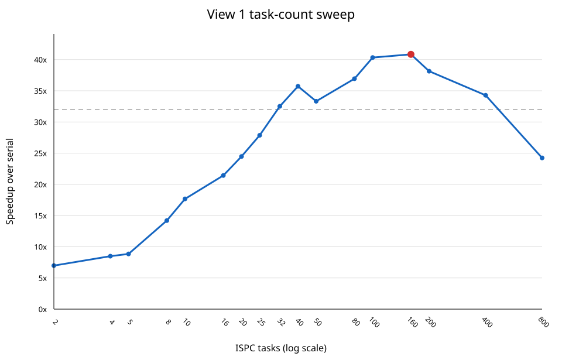

# Program 3, Part 2 — ISPC Tasks



The complete sweep is in [sweep_results.md](sweep_results.md) and
[sweep_results.csv](sweep_results.csv). Per-invocation data is available in
[sweep_trials.csv](sweep_trials.csv), the independent final verification is in
[final_results.md](final_results.md), and all 95 program outputs are preserved
in [`raw/`](raw/).

## English write-up

### Method

I changed only `mandelbrot_ispc_withtasks()` so that one `numTasks` value
controls both `rowsPerTask` and the `launch` count. The exported ISPC functions,
task kernel, C++ driver, image dimensions, and task runtime are unchanged.

The sweep used ISPC 1.28.1 with the assignment's 8-wide AVX2 flags. It ran
under WSL2 on an Intel Core i5-13500HX. WSL exposed 20 logical CPUs, so the
Linux pthread task runtime created 19 worker threads; the main thread also
processed queued tasks while synchronizing. Unlike Part 1, the process was not
pinned to one CPU because the purpose of this experiment is to use all cores
available to WSL. These are local-machine measurements, not Stanford `myth`
results.

I tested every selected positive divisor of the fixed 800-row image height:
2, 4, 5, 8, 10, 16, 20, 25, 32, 40, 50, 80, 100, 160, 200, 400, and 800.
Using divisors is important because the starter task kernel computes exactly
`rowsPerTask` rows and does not clamp its final row to `height`.

Each task count was compiled into a temporary ISPC object without rewriting the
tracked source, then run five times on View 1. Each executable invocation still
reports the minimum of three internal serial, ISPC, and task-ISPC trials. Every
run passed the program's element-wise comparison against the serial output.
The selection rule was fixed in advance: find the smallest task time, then
choose the smallest task count whose time is within 1% of it.

### Initial two-task result

| Tasks | Serial (ms) | ISPC (ms) | Task ISPC (ms) | vs serial | vs ISPC |
| ---: | ---: | ---: | ---: | ---: | ---: |
| 2 | 141.504 | 39.752 | 20.275 | 6.98x | 1.96x |

The original two-task version nearly doubles performance over single-core ISPC,
but it can use only two concurrently executing workers. It therefore leaves
most of the 20 WSL execution contexts idle.

### Task-count selection

Performance improved as the image was divided into more independently scheduled
row blocks. At 32 tasks the best measured time was 4.435 ms, or 32.51x over the
serial reference. The absolute best task time was 3.538 ms at 160 tasks. No
smaller candidate was within 1% of that value, so the final implementation uses
**160 tasks**, five rows per task.

| Tasks | Task ISPC (ms) | vs serial | vs ISPC |
| ---: | ---: | ---: | ---: |
| 2 | 20.275 | 6.98x | 1.96x |
| 20 | 5.925 | 24.47x | 6.77x |
| 32 | 4.435 | 32.51x | 9.09x |
| 80 | 3.870 | 36.93x | 10.50x |
| 100 | 3.598 | 40.33x | 11.30x |
| 160 | **3.538** | **40.84x** | **11.48x** |
| 400 | 4.211 | 34.28x | 9.53x |
| 800 | 5.926 | 24.24x | 6.85x |

The best task count is greater than the number of execution contexts because
Mandelbrot rows have unequal costs. With many small tasks, a worker that
finishes a cheap region can take another task instead of remaining idle while
another worker processes expensive boundary rows. This dynamic scheduling
reduces the block imbalance that limited Program 1. The task count cannot grow
without limit: queue operations, wakeups, task bookkeeping, and synchronization
become significant as each task gets smaller. The regression from 160 to 400
and 800 tasks demonstrates this overhead.

### Independent final verification

After writing 160 into the tracked source and performing a clean rebuild, I ran
both views in a separate five-invocation batch:

| View | Serial (ms) | ISPC (ms) | Task ISPC (ms) | vs serial | vs ISPC |
| ---: | ---: | ---: | ---: | ---: | ---: |
| 1 | 144.766 | 40.282 | 4.638 | 31.21x | 8.69x |
| 2 | 80.788 | 28.370 | 2.592 | 31.17x | 10.95x |

The identical 160-task computation reached 40.84x during the sweep but 31.21x
in the later View 1 batch. Individual final task timings also varied, especially
for View 2. This is retained rather than hidden: short multicore kernels are
sensitive to WSL host scheduling, dynamic frequency, background load, worker
wakeup latency, and virtualization noise. The sweep demonstrates a measured
result above the assignment's 32x target, while the independent batch shows
that the result is not stable enough to present as a guaranteed myth-machine
speedup.

### Reproduce

From `prog3_mandelbrot_ispc/`:

```bash
wget -O /tmp/ispc-v1.28.1-linux.tar.gz \
  https://github.com/ispc/ispc/releases/download/v1.28.1/ispc-v1.28.1-linux.tar.gz
tar -xzf /tmp/ispc-v1.28.1-linux.tar.gz -C /tmp

python3 part2/benchmark_part2.py --mode sweep \
  --ispc /tmp/ispc-v1.28.1-linux/bin/ispc --runs 5

make clean
make ISPC=/tmp/ispc-v1.28.1-linux/bin/ispc
python3 part2/benchmark_part2.py --mode final \
  --executable ./mandelbrot_ispc --final-task-count 160 --runs 5
```

The recorded environment used Linux
`6.18.33.2-microsoft-standard-WSL2`, GCC 15.2.0, GNU Make 4.4.1, Python
3.13.13, and ISPC 1.28.1.

## 中文分析

### 实验方法

实现只修改 `mandelbrot_ispc_withtasks()`：使用同一个 `numTasks` 同时决定
`rowsPerTask` 和 `launch` 数量。导出的 ISPC 接口、task kernel、C++ driver、图像尺寸
及公共 task runtime 均保持不变。

实验在 Intel Core i5-13500HX 的 WSL2 环境中使用 ISPC 1.28.1 和作业原有的
8-wide AVX2 参数。WSL 暴露 20 个逻辑 CPU，因此 Linux pthread runtime 创建 19 个
worker，主线程在等待同步时也会从队列取任务。Part 2 需要利用全部可用核心，所以没有
像 Part 1 一样固定到单个 CPU。本报告是本机结果，不是 Stanford `myth` 实机数据。

扫描的任务数为 2、4、5、8、10、16、20、25、32、40、50、80、100、160、200、
400 和 800，它们都能整除固定的 800 行图像。这样做可以保证原始 task kernel 在没有
截断 `yend` 的情况下既不遗漏最后几行，也不会越界。每个候选在 View 1 上独立运行
5 次，每次程序调用内部仍分别运行 3 次并取最小值。全部 85 次扫描都通过了 task ISPC
与串行输出的逐像素比较。

### 初始结果和最终选择

初始 2-task 版本耗时 20.275 ms，相对串行为 6.98x，相对普通单核 ISPC 为 1.96x。
它虽然几乎获得了两倍于单核 ISPC 的性能，但只能让两个执行者并行工作，其余 WSL
执行上下文得不到利用。

增加任务数会产生更细的连续行块。廉价区域先完成的 worker 可以继续领取其他任务，
不必等待处理昂贵分形边界的 worker，因此动态任务队列同时改善了核心利用率和负载
均衡。32 tasks 已达到 4.435 ms、32.51x；160 tasks 的最低时间为 3.538 ms，达到
40.84x 串行加速和 11.48x 普通 ISPC 加速。按照预先规定的“最快值 1% 内选择最小任务
数”规则，最终默认值确定为 **160 tasks**，每个 task 负责 5 行。

任务也不能无限细分。任务入队、worker 唤醒、任务元数据以及最终同步都有固定成本。
当任务数增至 400 和 800 时，task 时间分别回升到 4.211 ms 和 5.926 ms，说明调度
开销已经超过继续细分带来的负载均衡收益。

最终源码干净重建后，独立批次的 View 1 和 View 2 分别得到 31.21x 和 31.17x。
相同的 160-task 代码在扫描阶段达到 40.84x，而后续批次明显较低；逐次数据也显示较大
波动。这说明只有几毫秒的多核 kernel 容易受到 WSL 宿主调度、动态频率、后台负载、
worker 唤醒延迟和虚拟化噪声影响。报告保留两组真实数据：扫描阶段确实超过课程给出的
32x 目标，但不能把这一峰值当作 myth 主机上稳定可复现的保证。

本实现未完成或讨论 Extra Credit 的 thread/task 抽象比较。
